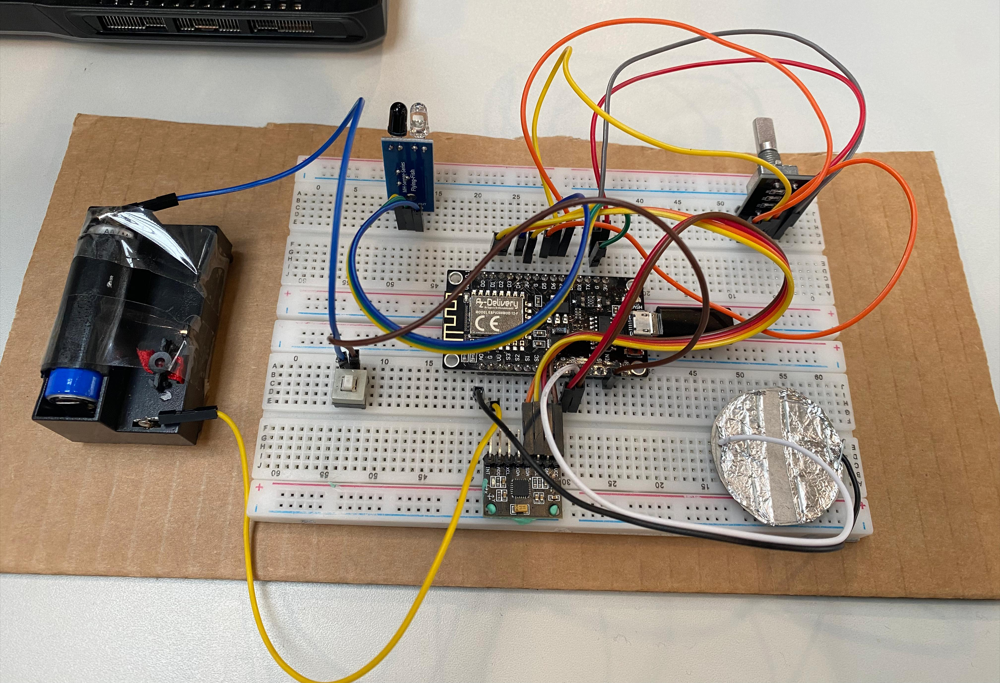

## Overview
### The outcome of this project is to understand the working of various sensors and their applications by integrating the sensor system to control a humanoid robot in a predeveloped open world game environment.

### The presentation of this project can be found 

## Hardware setup
### 

### The setup consists of the following items:
#### 1. MPU6050 Accelerometer
#### 2. IR Sensor
#### 3. Rotary Encoder
#### 4. Battery Holder
#### 5. Touch Sensor
#### 6. Jumper wires
#### 7. ESP8266 Microcontroller
#### 8. Breadboard

## Robot Demonstration
### 
